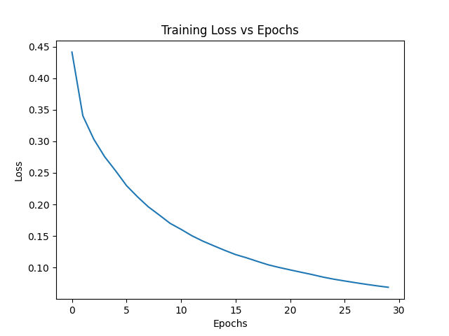
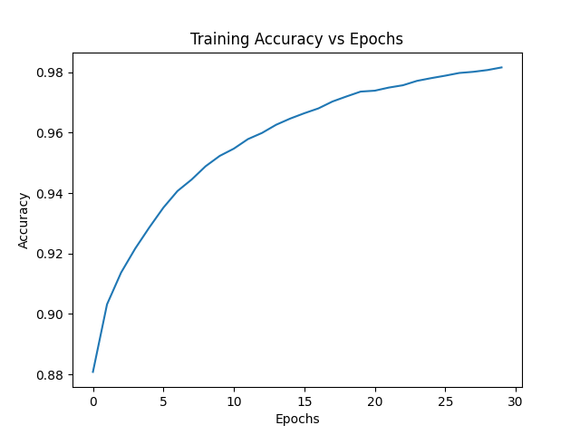
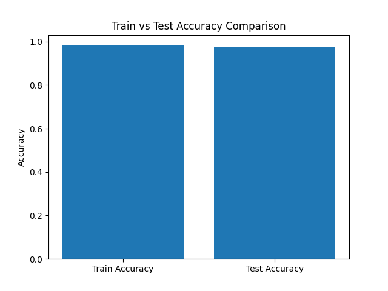
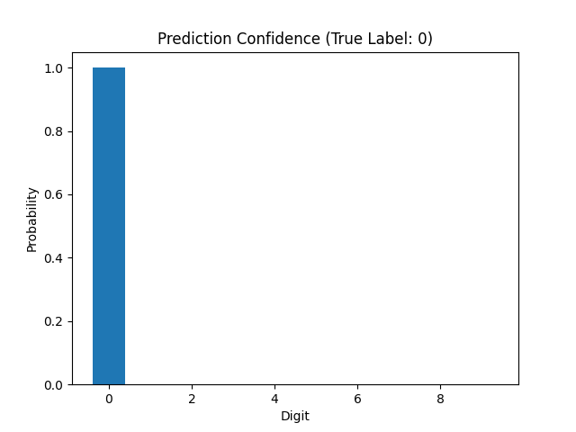
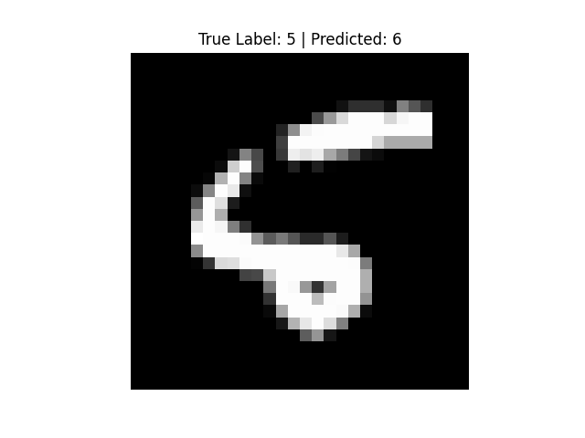

# Basic Neural Network from Scratch – Digit Classification

## Overview

This project implements a Basic neural network from scratch using only NumPy to classify handwritten digits (0–9).  
The objective is to demonstrate a clear understanding of **Artificial Intelligence fundamentals**, including forward propagation, activation functions, loss computation, optimization, and result visualization—**without using any machine learning libraries**.

The model is trained and evaluated on the **MNIST handwritten digits dataset** (CSV format).

---

## Assignment Objectives

- Build a neural network **from scratch**
- Use **NumPy only** (no TensorFlow, PyTorch, scikit-learn, etc.)
- Implement:
  - Forward propagation
  - Activation functions
  - Loss and accuracy calculation
- Visualize training results
- Clearly demonstrate learning behavior

---

## Dataset

- **Dataset:** MNIST Handwritten Digits (CSV format)
- **Source:** Kaggle
- **Classes:** Digits 0–9
- **Image Size:** 28 × 28 (flattened to 784 features)
- **Training Samples:** 60,000
- **Test Samples:** 10,000

Each image is represented as a vector of pixel values normalized to the range `[0, 1]`.

---

## Neural Network Architecture

The neural network follows a simple fully connected architecture:

Input Layer (784)
↓
Hidden Layer (256 neurons, ReLU)
↓
Output Layer (10 neurons, Softmax)


- **Activation (Hidden Layer):** ReLU  
- **Activation (Output Layer):** Softmax  
- **Loss Function:** Categorical Cross-Entropy  
- **Optimization:** Mini-batch Gradient Descent  

---

## Training Configuration

- **Hidden Units:** 256  
- **Learning Rate:** 0.05  
- **Batch Size:** 128  
- **Epochs:** 30  

Mini-batch gradient descent is used to improve convergence speed while keeping the implementation fully from scratch and conceptually simple.

---

## Results

### Final Performance

- **Training Accuracy:** ~98%
- **Test Accuracy:** **97.33%**

The close alignment between training and test accuracy indicates strong generalization.

---

## Training Curves (Required)

### Training Loss vs Epochs


### Training Accuracy vs Epochs


These curves show stable optimization and smooth convergence.

---

## Additional Analysis (Beyond Requirements)

### Train vs Test Accuracy Comparison


This comparison highlights strong generalization with minimal overfitting.

---

### Prediction Confidence (Softmax Probabilities)


This visualization shows the probability distribution over all digit classes for a single test example, demonstrating model confidence and interpretability.

---

### Misclassification Example


This example highlights a failure case, demonstrating awareness of model limitations.

---

## Project Structure

DIGITS_CLASSIFICATION/
│
├── data/
│ ├── mnist_train.csv
│ └── mnist_test.csv
│
├── notebooks/
│ └── Neural_Network_From_Scratch.ipynb
│
├── outputs/
│ ├── loss_curve.png
│ ├── accuracy_curve.png
│ ├── train_vs_test_accuracy.png
│ ├── prediction_confidence.png
│ └── misclassification_example.png
│
├── src/
│ └── main.py
│
├── requirements.txt
├── README.md
└── .gitignore


---

## How to Run the Project

### 1. Install Dependencies

```bash
pip install -r requirements.txt


2. Run the Training Script

cd src
python main.py

This will:
Train the neural network
Print training progress
Evaluate test accuracy
Save loss and accuracy graphs to the outputs/ folder


3. Notebook (Optional)
For step-by-step explanations, experiments, and additional visualizations, open:

notebooks/Neural_Network_From_Scratch.ipynb


Key Learnings
Implemented a neural network entirely from scratch
Understood forward and backward propagation mathematically
Observed the impact of mini-batch gradient descent
Learned how to analyze training curves and prediction confidence
Gained experience in presenting AI results professionally


Notes
No machine learning or deep learning libraries were used.
Model persistence was intentionally omitted, as deployment was outside the scope of this foundational assignment.
The focus of this project is clarity, correctness, and learning, not production optimization.


Conclusion
This project demonstrates a strong understanding of AI foundations by implementing a neural network from first principles using NumPy.
The clean training behavior, strong test accuracy, and detailed visual analysis validate the correctness and robustness of the approach.